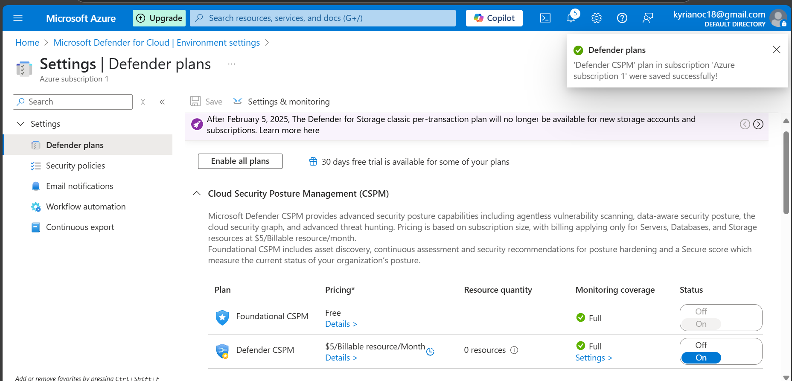
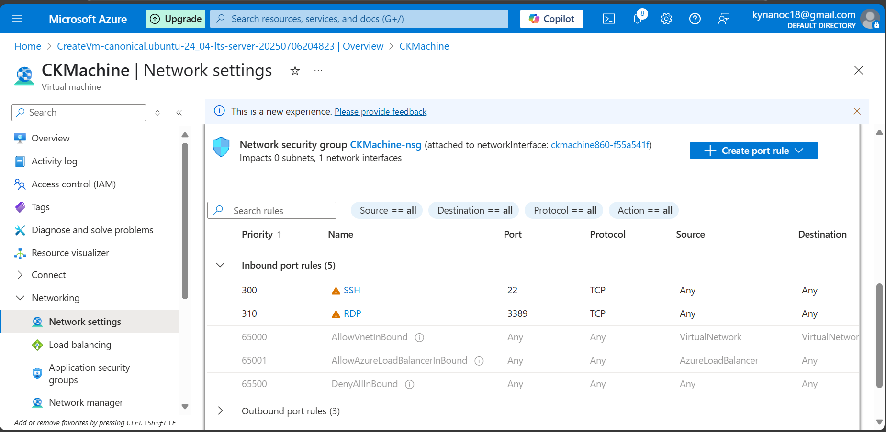
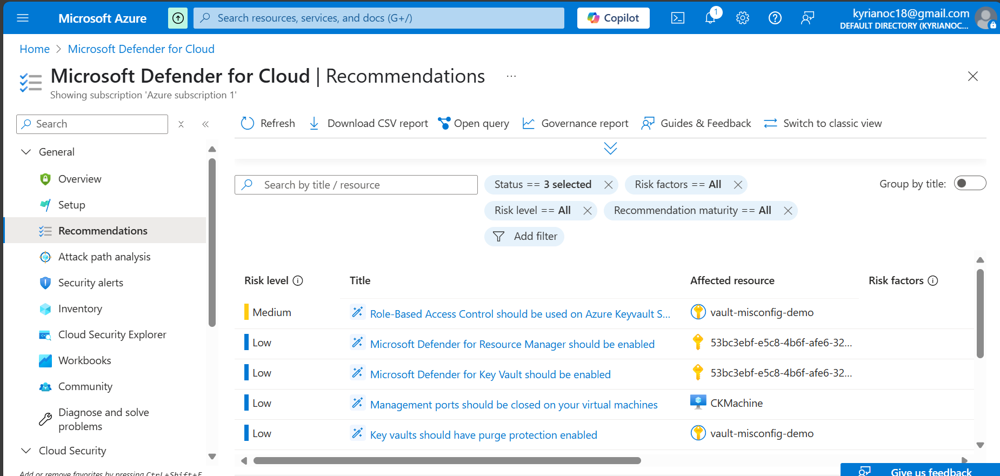
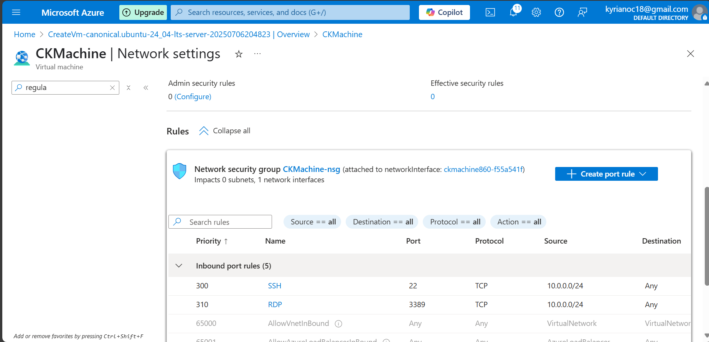
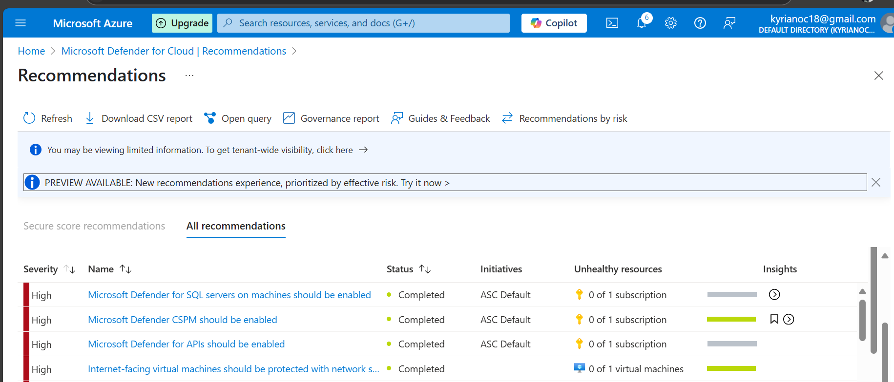

# Azure Defender for Cloud Security Lab

### Author: Kyrian Onyeagusi
🔗 [LinkedIn](https://www.linkedin.com/in/kyrian-onyeagusi/) | 📧 [Email](mailto:kyrianoc18@gmail.com)

---

## Focus: Identifying and remediating real-world cloud misconfigurations using Microsoft Defender for Cloud

---

## Overview

In this project, I simulated common cloud misconfigurations and used Microsoft Defender for Cloud to detect, analyze, and remediate them. This lab mirrors real-world scenarios where misconfigured services expose organizations to risk and demonstrates my ability to improve cloud security posture using Azure-native tools.

The objective was to expose a virtual machine to the internet using overly permissive network rules, allow Defender to identify the risks, and then implement secure configurations to eliminate the threats.

---

## Tools & Skills Demonstrated

* Microsoft Defender for Cloud 
* Azure Virtual Machine security hardening
* Network Security Group (NSG) rule configuration
* Regulatory compliance dashboard review
* Vulnerability detection and remediation

---

## Environment Setup

* Azure Virtual Machine (B1s)
* Microsoft Defender for Cloud 
* NSG rules simulating RDP and SSH exposure

> ✅ **Screenshot:** Defender for Cloud plan enabled
> 

> ✅ **Screenshot:** NSG rule allowing public SSH or RDP from 0.0.0.0/0
> 

---

## What I Did

I deployed a test virtual machine with a public IP and modified its NSG to allow inbound SSH (port 22) or RDP (port 3389) from any IP address. This insecure setup was designed to trigger alerts from Microsoft Defender for Cloud.

> ✅ **Screenshot:** Security recommendations triggered by Defender
> 

I also explored the regulatory compliance section to assess the subscription’s alignment with security benchmarks such as Azure Security Benchmark (ASB) and CIS.

> ✅ **Screenshot:** Compliance dashboard highlighting failed controls
> 

To fix the issue, I updated the NSG rule to restrict access to a specific IP address, reducing the attack surface. I also rechecked the recommendations to verify the improvement.

> ✅ **Screenshot:** NSG remediated to allow access from known IP only
> 

> ✅ **Screenshot:** Defender for Cloud showing cleared recommendations
> 

---

## Why This Matters

Cloud misconfigurations are a top cause of breaches. This project demonstrates my ability to:

* Recognize insecure configurations in real-world environments
* Use Microsoft Defender for Cloud for proactive threat detection
* Align cloud deployments with industry-standard compliance frameworks

---

## Outcome

This project proves I can:

* Conduct security posture assessments using Defender for Cloud
* Remediate exposed services and insecure firewall rules
* Apply Azure-native tools to protect infrastructure and meet compliance goals

---

## 🔗 Connect

Kyrian Onyeagusi
🔗 [LinkedIn](https://www.linkedin.com/in/kyrian-onyeagusi/) | 📧 [Email](mailto:kyrianoc18@gmail.com)
